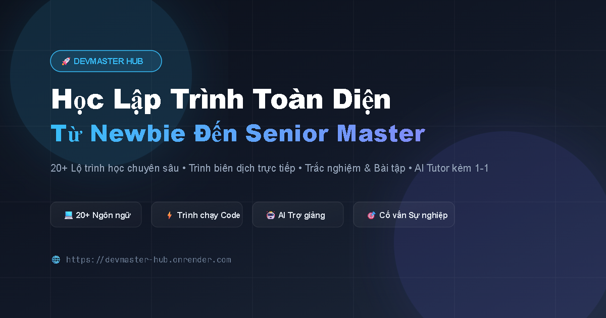

# DevMaster Hub

Nền tảng học lập trình từ Newbie đến Senior — **34 lộ trình, 348 bài học**, có trình chạy code ngay trên trình duyệt, trắc nghiệm tự sinh và AI Tutor kèm 1-1.

**Demo:** https://devmaster-hub.onrender.com



---

## Tính năng

| Tính năng | Mô tả |
|---|---|
| **Lộ trình học** | 34 công nghệ chia theo 5 cấp độ, mỗi bài gồm lý thuyết, code mẫu, trắc nghiệm và bài tập |
| **AI Tutor** | Gia sư kèm 1-1 trong từng bài, gợi ý hướng làm thay vì đưa đáp án |
| **Project Lab** | Sinh ý tưởng dự án theo trình độ, nộp code và nhận review chấm theo 4 tiêu chí |
| **Cố vấn nghề nghiệp** | Phân tích định hướng, đọc được cả link tin tuyển dụng người dùng dán vào |
| **Tìm việc** | JSearch là nguồn chính, tự chuyển sang Remotive + Arbeitnow khi lỗi |
| **Studio** | Sandbox chạy code, Visual Builder, Game Tilemap, SQL Studio, API Tester, CTF Terminal |
| **Đa ngôn ngữ** | 8 ngôn ngữ giao diện, AI trả lời theo đúng ngôn ngữ đang chọn |

## Công nghệ sử dụng

**Frontend** — JavaScript thuần, không framework, không build step. Định tuyến bằng History API.
**Backend** — Node.js + Express, một file `server.js` đóng vai trò proxy AI và lớp bảo vệ.
**Dữ liệu** — Supabase (Postgres + Auth), bảo mật bằng Row Level Security.
**AI** — Bộ định tuyến đa nhà cung cấp: OpenRouter, Gemini, DeepSeek, Groq, Claude, tự chuyển khi một bên lỗi.

---

## Chạy trên máy

Yêu cầu **Node.js 18 trở lên** (code dùng `fetch` toàn cục).

```bash
git clone https://github.com/kabao0905/DevMasterHub.git
```

```bash
cd DevMasterHub && npm install
```

```bash
cp .env.example .env
```

Mở `.env` và điền ít nhất một khóa AI — `OPENROUTER_API_KEY` là tiện nhất vì một khóa dùng được nhiều mô hình.

```bash
npm start
```

Mở http://localhost:3000

### Thiết lập Supabase

Chạy toàn bộ `supabase-schema.sql` trong SQL Editor của Supabase, sau đó vào **Authentication → Settings → Email** tắt *Confirm email* (dự án dùng cơ chế đăng nhập bằng tên đăng nhập, không dùng email thật).

---

## Cấu trúc thư mục

```
public/            ← toàn bộ file được phục vụ ra Internet
  index.html
  app.js           giao diện và định tuyến
  i18n.js          từ điển 8 ngôn ngữ
  data*.js         dữ liệu 34 lộ trình học
  auth-service.js  đăng nhập và đồng bộ tiến độ qua Supabase
  ai-service.js    gọi AI cho bài học, quiz, bài tập
  career-advisor.js
  assets/

server.js          proxy AI, lớp bảo vệ, chèn meta SEO, sinh sitemap
supabase-schema.sql
.env               ← KHÔNG bao giờ commit
```

Mọi thứ nằm **ngoài** `public/` đều không thể truy cập từ Internet. Đây là điểm quan trọng: `server.js`, `.env` và `package.json` được bảo vệ bằng cấu trúc thư mục, không phải bằng danh sách chặn — danh sách chặn luôn có nguy cơ sót.

---

## Cách hoạt động

### Bảo vệ chi phí API

`/api/ai` và `/api/crawl` bắt buộc phải có token Supabase hợp lệ. Nếu không có lớp này, bất kỳ ai biết địa chỉ server đều gọi được và tiêu tiền API của chủ dự án.

Giới hạn số lần gọi tính theo **user id** khi đã đăng nhập, chỉ dùng IP cho khách. IP lấy từ `req.ip` với `trust proxy` đã bật — không đọc trực tiếp header `x-forwarded-for` vì header đó do client tự đặt và giả được.

### Chặn SSRF ở `/api/crawl`

Endpoint này tải trang web do người dùng đưa vào, nên phải:

1. Phân giải DNS rồi đối chiếu IP thật với dải nội bộ (loopback, `10.x`, `192.168.x`, `169.254.169.254`…).
2. Đặt `redirect: 'manual'` — nếu để tự đi theo redirect, một URL public có thể chuyển hướng 302 về địa chỉ nội bộ và vượt qua bước 1.
3. Chỉ nhận `Content-Type` là HTML, giới hạn dung lượng tải về.

### SEO cho ứng dụng một trang

Trình thu thập của Facebook, Zalo, X và LinkedIn **không chạy JavaScript**, còn Google đọc HTML thô ở lượt đầu. Vì vậy `server.js` thay `<title>`, `canonical` và các thẻ `og:*` ngay trong HTML trước khi trả về, dựa trên đường dẫn được yêu cầu.

`sitemap.xml` được sinh động từ chính dữ liệu bài học, nên thêm bài mới là sitemap tự cập nhật — hiện có 385 URL.

---

## Giấy phép

[MIT](LICENSE)
